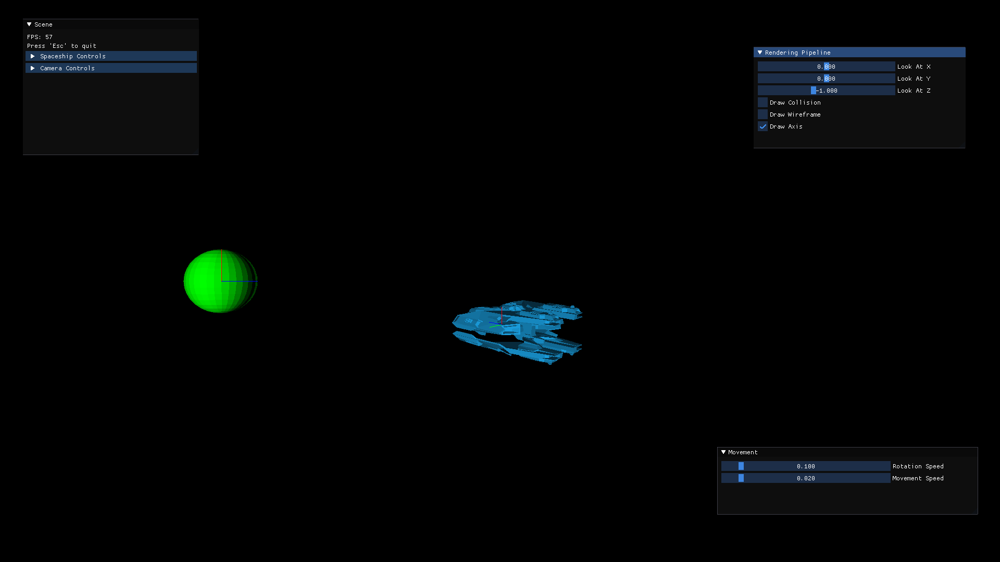

# Virtual Galaxy
Avans Hogeschool - Linear Algebra assessment by Bram Bastiaansen and Chris Schilders


## Requirements
* CMake 3.14+
* A C++17 compatible compiler

## Configure 
```bash
cmake -S . -B build
```
Add -GNinja if you have Ninja.

## Build
```bash
cmake --build build
```

# Credits
The base CMake starter has been taken from:  
https://gitlab.com/CLIUtils/modern-cmake/-/tree/master/examples/extended-project

Edge function technique
https://www.cs.drexel.edu/~david/Classes/Papers/comp175-06-pineda.pdf